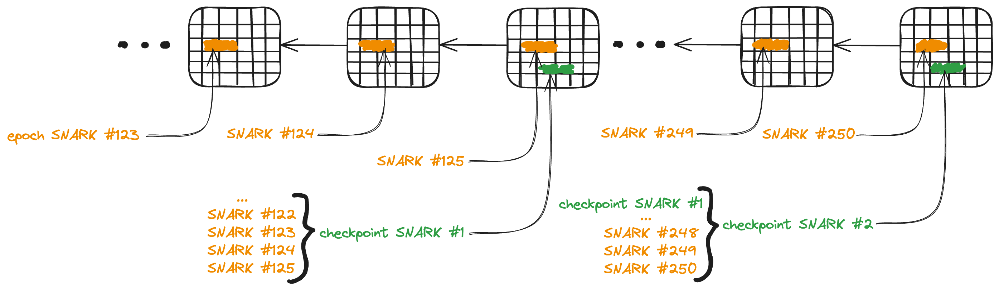

# ADR: Implementing Checkpoints via Recursive SNARKs

## Context

Prism currently uses Bellman Groth16 zk-SNARKs in a two-layer approach:

1. Individual Merkle proof SNARKs are created for each operation.
2. These SNARKs are aggregated into epoch SNARKs, also using Groth16

The epoch SNARKS are posted to the Celestia DA Layer. This allows for WASM-compatible light clients but faces limitations since Celestia only stores blocks for approximately 4 weeks. For example, it creates a synchronization challenge for new light clients joining after this period. We need a solution for long-term verifiability and efficient syncing for new light clients.

## **Decision**

We will implement a checkpoint system using recursive SNARKs ("checkpoint SNARKs") that prove the validity of multiple previous epoch SNARKs. It will allow new light clients to sync from the latest checkpoint SNARK and the upcoming SNARKs from that point forward. This implementation will be done in two stages:

Stage 1: Implement checkpoint SNARKs using Groth16, leveraging our existing codebase and infrastructure.

Stage 2: Explore and transition to more advanced solutions like Nova or zkVMs (e.g., Nexus with HyperNova backend) for future developments, particularly in preparation for based rollups.

## Checkpoint SNARKs

<picture>
  <source media="(prefers-color-scheme: dark)" srcset="../assets/checkpoint_snarks_dark.png">
  
</picture>

## Status

Proposed

## Consequences

### Positive

1. Enables long-term verifiability without relying on Celestia's limited block storage.
2. Reduces the initial sync time and data requirements for new light clients.
3. Maintains the security guarantees of the original system while extending its timeframe.
4. Stage 1 allows for quick deployment using existing infrastructure.
5. Stage 2 prepares the system for future expansions and optimizations.

### Negative

1. Increased complexity in the proving system.
2. Potential performance overhead in generating recursive SNARKs, especially in Stage 1.

### Risks

1. Recursive SNARK generation is computationally intensive and time-consuming, especially in Stage 1.
2. Potential vulnerabilities in the recursive SNARK implementation could compromise the entire history.
3. Compatibility issues between different SNARK systems used for epochs and checkpoints (Transition to Stage 2 - if not well thought through - may introduce compatibility issues with existing proofs and clients).

## Implementation Details

### Stage 1: Groth16 Checkpoint SNARKs

#### Defining a starting checkpoint interval

For the start, we create a checkpoint snark every 125 epochs. Our pessimistic estimate is that a light client can sync at least 25 epochs/minute. This way we can enable fast syncing.

#### Recursive Groth16 SNARK Circuit Design for Verifying Multiple Epoch SNARKs

##### 1. Circuit Structure

The recursive circuit should be designed to:

1. Verify the proof of the previous checkpoint SNARK (if it exists)
2. Verify a batch of epoch SNARKs since the last checkpoint (between two checkpoints)
3. Compute a new state (commitment) that represents the accumulation of all verified epochs

##### 2. Input Structure

The circuit should take the following inputs:

- Previous checkpoint proof
- Array of epoch SNARK (`BatchedMerkleProof`) proofs to be verified
- public inputs for checkpoint SNARK consist of
  - new commitment of latest checkpoint snark ("old commitment" for checkpoint snark)
  - latest commitment of latest epoch SNARK ("new commitment" for checkpoint snark)

##### 3. Circuit Logic

The circuit should perform these operations:

1. Verify the previous checkpoint proof (if it exists)
2. For each epoch SNARK:
   a. Verify the Groth16 proof
   b. Update the accumulated state based on the epoch's changes
3. Ensure the final accumulated state matches the provided new state

##### 4. Testing and Verification

Develop tests to:

1. Verify correct operation with valid inputs
2. Ensure proper rejection of invalid inputs
3. Test edge cases and boundary conditions

In sum the circuit could look like this:

```rust
struct RecursiveCheckpointCircuit {
    previous_checkpoint_initial_commitment: Option<Hash>,
    previous_checkpoint_proof: Option<Groth16Proof>,
    initial_checkpoint_commitment: Hash,
    final_checkpoint_commitment: Hash,
    epoch_proofs: Vec<Groth16Proof>,
}

impl Circuit<Bls12> for RecursiveCheckpointCircuit {
    fn synthesize<CS: ConstraintSystem<Bls12>>(self, cs: &mut CS) -> Result<(), SynthesisError> {
        let mut current_state = hash_to_scalar(self.initial_checkpoint_commitment);

        if let (Some(prev_commitment), Some(prev_proof)) = (self.previous_checkpoint_initial_commitment, self.previous_checkpoint_proof) {
            let prev_commitment_scalar = hash_to_scalar(&prev_commitment)?;
            verify_groth16_checkpoint_snark(
                cs.namespace(|| "verify previous checkpoint snark"),
                &CHECKPOINT_VERIFYING_KEY,
                &prev_proof,
                &[prev_commitment_scalar, current_state]
            )?;
        }

        let mut final_checkpoint_scalar = hash_to_scalar(self.final_commitment);
        // alloc final commitmnet as variable like
        let final_checkpoint_var =
        cs.alloc(|| "final checkpoint", || Ok(final_checkpoint_scalar))?;

        for (i, proof) in self.epoch_proofs.iter().enumerate() {
            // Verify the epoch proof
            current_state = verify_groth16_epoch_snark(cs, &EPOCH_VERIFYING_KEY, proof, &[current_state])?;
        }

        let recalculated_final_checkpoint_var =
        cs.alloc(|| "recalculated final checkpoint", || Ok(current_state))?;

        // Check that the final state matches the provided final commitment
        cs.enforce(
            || "final state check",
            |lc| lc + recalculated_final_checkpoint_var,
            |lc| lc + CS::one(),
            |lc| lc + final_checkpoint_var,
        );

        Ok(())
    }
}
```

#### Implement a process to generate and post checkpoint SNARKs to Celestia

Integration with current epoch finalization:
Our current finalize_epoch method handles individual epochs. The checkpoint process will operate at a higher level, encompassing multiple epochs. We'll need to keep track of the epoch number to trigger checkpoint generation at the right intervals.

```rust
impl Sequencer {
    // ... existing methods ...

    async fn checkpoint_loop(self: Arc<Self>) -> Result<(), Error> {
        info!("starting checkpoint loop");
        // checkpoint interval eg 125 epochs every 7500 seconds
        let mut ticker = interval(Duration::from_secs(self.checkpoint_interval));
        spawn(async move {
            loop {
                ticker.tick().await;
                match self.generate_and_post_checkpoint().await {
                    Ok(_) => info!("Checkpoint generated and posted successfully"),
                    Err(e) => error!("Error in checkpoint generation/posting: {}", e),
                }
            }
        })
        .await
    }

    async fn generate_and_post_checkpoint(&self) -> Result<()> {
        // 1. Gather data for checkpoint
        // 2. Generate checkpoint SNARK
        // 3. Post to Celestia
        // 4. Handle errors and retries
    }
}
```

Data gathering:
We're already storing commitments for each epoch in our database. We'll need to retrieve these for the checkpoint SNARK generation:

```rust
let prev_checkpoint_commitment = self.db.get_commitment(&prev_checkpoint_epoch)?;
let current_commitment = self.get_commitment().await?;
```

Celestia posting:
We can extend your existing `DataAvailabilityLayer` trait to include a method for posting checkpoints:

```rust
#[async_trait]
pub trait DataAvailabilityLayer: Send + Sync {
    // ... existing methods ...

    async fn submit_checkpoint(&self, checkpoint: &CheckpointData) -> Result<()>;
}
```

#### Modify light clients to start syncing from the latest checkpoint SNARK

<picture>
  <source media="(prefers-color-scheme: dark)" srcset="../assets/syncinc_lc_dark.png">
  
</picture>

##### Light Client Synchronization Process

1. Initial Sync:
   - New light clients must sync from the Celestia data availability layer, starting from the genesis block or their last known trusted state.
   - They cannot rely on an external API for the latest checkpoint, as this would introduce a trust assumption that could compromise security.

2. Checkpoint Discovery:
    - Light clients scan through the Celestia chain, searching for the most recent checkpoint SNARK in the designated namespace.
    - This process ensures they find the latest checkpoint without trusting any external source.

3. Checkpoint Verification:
    - Once the latest checkpoint SNARK is found, the light client verifies the SNARK.
    - This verification proves the validity of the chain state up to that checkpoint without the further need to process/ sync all previous epochs.

4. Forward Sync:
    - After verifying the checkpoint, the light client can sync forward, processing only the epoch SNARKs posted after the checkpoint.
    - This significantly reduces the sync time and computational requirements for new clients.
    - This also means that Celestia's block storage time, which is limited to approx. 4 weeks, is not a problem

##### Possible implementation

Adding a `last_verified_checkpoint` to the `LightClient` struct to keep track of the latest verified checkpoint:

```rust
pub struct LightClient {
    pub da: Arc<dyn DataAvailabilityLayer>,
    pub verifying_key: Option<String>,
    start_height: u64,
    last_verified_checkpoint: Option<CheckpointSnark>,
}
```

accordingly we have to modify the `new()`-function:

```rust
pub fn new(
        da: Arc<dyn DataAvailabilityLayer>,
        cfg: CelestiaConfig,
        sequencer_pub_key: Option<String>,
    ) -> LightClient {
        LightClient {
            da,
            verifying_key: sequencer_pub_key,
            start_height: cfg.start_height,
            last_verified_checkpoint: None,
        }
```

We also need to implement a find_and_verify_latest_checkpoint method to scan backwards from the current height to find and verify the latest checkpoint SNARK.

```rust
async fn find_and_verify_latest_checkpoint(&mut self, start: u64, end: u64) -> Result<()> {
    for height in (start..=end).rev() {
        if let Some(checkpoint) = self.da.get_checkpoint(height).await? {
            if self.verify_checkpoint(&checkpoint).await? {
                self.last_verified_checkpoint = Some(checkpoint);
                return Ok(());
            }
        }
    }
    Err(GeneralError::NotFoundError("No valid checkpoint found".into()).into()) // better error
}

async fn verify_checkpoint(&self, checkpoint: &CheckpointSnark) -> Result<bool> {
    // Implement checkpoint verification logic
    validate_checkpoint_snark(checkpoint)
}

async fn sync_loop(self: Arc<Self>) -> Result<(), tokio::task::JoinError> {
        info!("starting SNARK sync loop");
        let start_height = self.start_height;
        spawn(async move {
            // ...
            loop {
                // ...

                if self.last_verified_checkpoint.is_none() {
                    self.find_and_verify_latest_checkpoint(current_position, target).await?;
                }

                // ...
            }
        }).await
    }
```

### Stage 2: Transition to Advanced SNARK Systems

1. Evaluate Nova and zkVM solutions (e.g., Nexus with HyperNova) for compatibility with our use case and future based rollup plans.
2. Develop a prototype implementation using the chosen system.
3. Create a migration strategy in an update to this ADR for existing proofs and clients.
4. Update this ADR with a testing strategy and execute it before deployment.

## Why Nova (SuperNova / HyperNova) could be Beneficial for Us

1. Efficiency: By leveraging Nova's efficient folding scheme, we achieve significant reductions in constraint complexity, enhance scalability through efficient proof aggregation, and lower resource requirements. This allows for faster proving times, reduced memory usage, and the ability to operate effectively on less powerful hardware, making our system more efficient and scalable in the long term.

2. Future-proofing: Nova's design aligns well with potential future requirements, such as more complex proof structures or more frequent updates.

## Alternatives Considered

1. Using a different data availability layer with longer-term storage.
2. Exploring other SNARK systems like Halo2 (even though we do think Nova provides better efficiency for our specific use case of repeated proof aggregation).

## Open Questions

1. How do we handle the transition period where both Groth16 and Nova proofs might coexist?
2. What specific based rollup features will we need to prove in Stage 2, and how do they influence our choice between Nova and a zkVM solution?
3. How can we ensure smooth transition and backwards compatibility when moving from Stage 1 to Stage 2?

## Action Items

1. Implement and test the Groth16-based checkpoint system (Stage 1).
2. Conduct a detailed analysis of Nova and zkVM solutions, considering our based rollup requirements.
3. Develop proof-of-concept implementations for both Nova and a zkVM solution for comparison.
4. Create a detailed migration plan for transitioning from Stage 1 to Stage 2.
