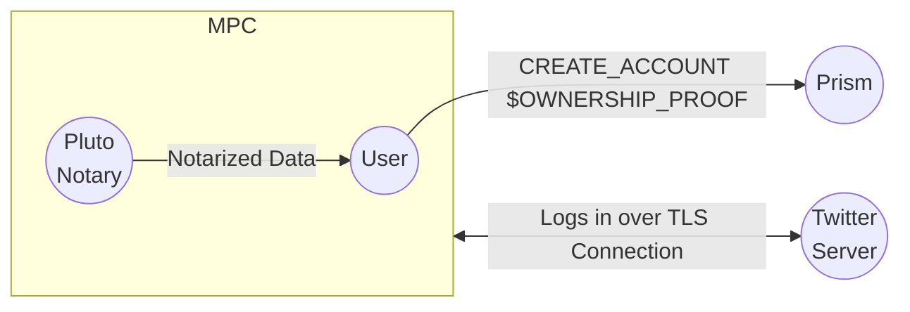
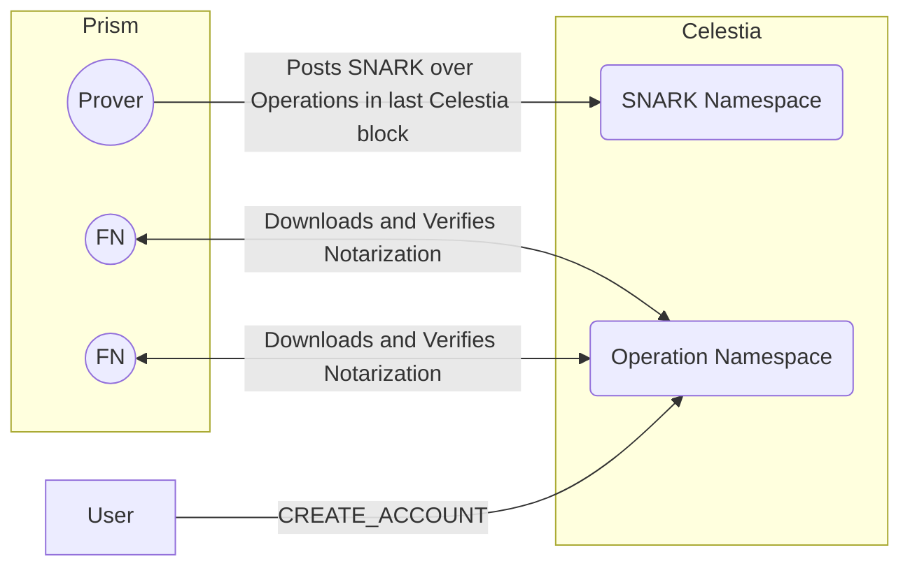

# ADR 2 - CREATE_ACCOUNT Operation

## Rationale

Once a new user is added to the IMT, we know that all updates to a hashchain are valid by construction- updates must be signed by an already existing key in the hashchain. But who gets to add the first key for a user? Why should we trust that the first key added actually comes from the user?

## Status Quo

The de facto solution to this problem is by centralizing the account creation - a service exists that signs off on an account creation event after a user verifies to the central entity that they own some resource, i.e. a phone number via an OTP.

This creates cause for concern:

1. Trust is placed on the entity to not only carry out the validation securely, but also to not impersonate users
2. Liveness assumption of the entity, where the entire network depends on them for account creation to be available

## Proposal

To solve this, we propose a CREATE_ACCOUNT operation that mitigates both of these issues to a great extent (but not necessarily completely). Services such as TLSNotary and zkEmail can be enshrined into the protocol in a way that lets users create accounts after a resource ownership proof. This proving is done out of band of the Prism protocol, and the proof is posted as part of the CREATE_ACCOUNT operation. What gets enshrined into operation processing is the validity rules of each external protocol’s proof system.

For TLSNotary, it may look something like this:

Note that this allows for the addition of arbitrary account sources. Unlike Signal where all IDs originate from a phone number registration signed off by Signal’s infrastructure, applications on Prism can use accounts from any website for registration.

When full nodes download the set of operations from a Celestia block, they will only apply the IMT state transition for a corresponding CREATE_ACCOUNT operation if it is valid according to the proof system’s ruleset.

## Downsides

- Each protocol we want to add support for complicates the state machine, as they need to be enshrined. The reason they need to be enshrined is because the prover needs to be able to make a SNARK that a given proof is invalid if it is junk.
- There are trust assumptions on the Notary in the case of a TLSNotary integration. Which set of notaries do we trust? Only trusting Pluto’s notary seems like a good call for now
