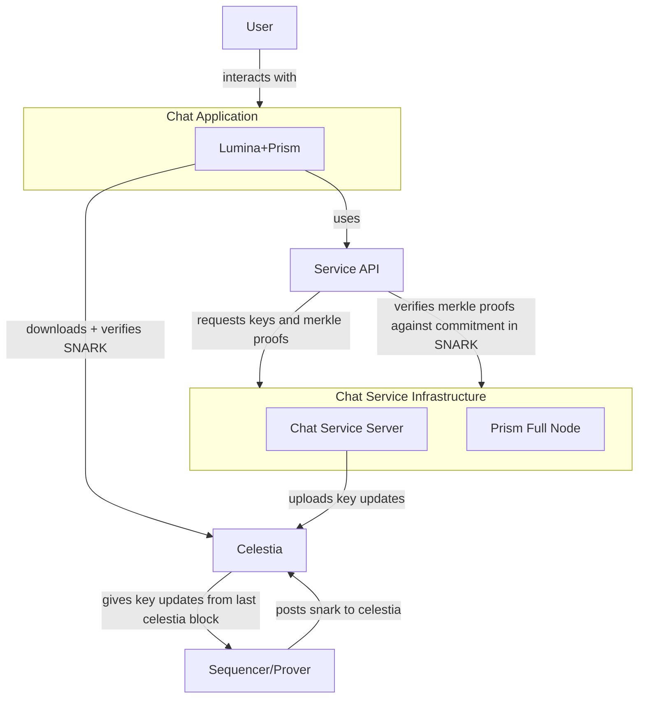

# Architecture

We operate as a based rollup on Celestia. The SNARKs are posted to one namespace, and the operations are posted to a secondary namespace, enabling full nodes. This architecture is designed to be trust-minimized and censorship-resistant.

The sequencer is a partially unprivileged sequencer: while anybody can post update operations to the base layer, account creations must be signed by the sequencer. This is a temporary measure discussed in [adr-003 (Service Registration)](https://github.com/deltadevsde/prism/blob/main/adr/adr-003-service-registration.md).

Light nodes verify the state by downloading and verifying the SNARKs posted to Celestia. There is currently no P2P overlay for the Prism network.

1. An epoch is defined by the valid operations posted to the namespace in the previous Celestia block.
2. Services can replicate the state by running a full node, to serve their own stack and not rely on the liveness of the sequencer.
3. Enables future prover decentralization (perhaps with a prover marketplace).
4. Censorship resistance (updates can be posted directly to the DA layer).

