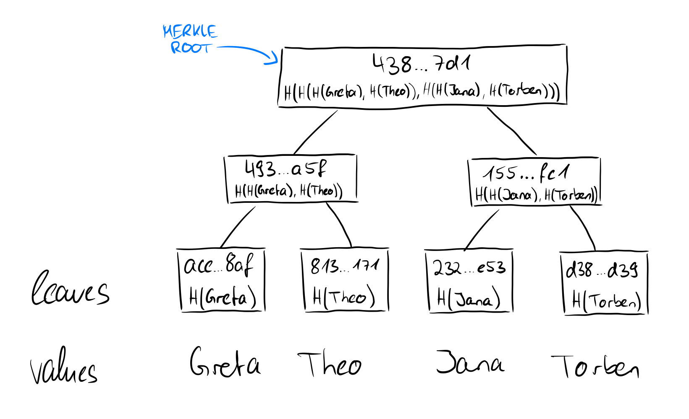
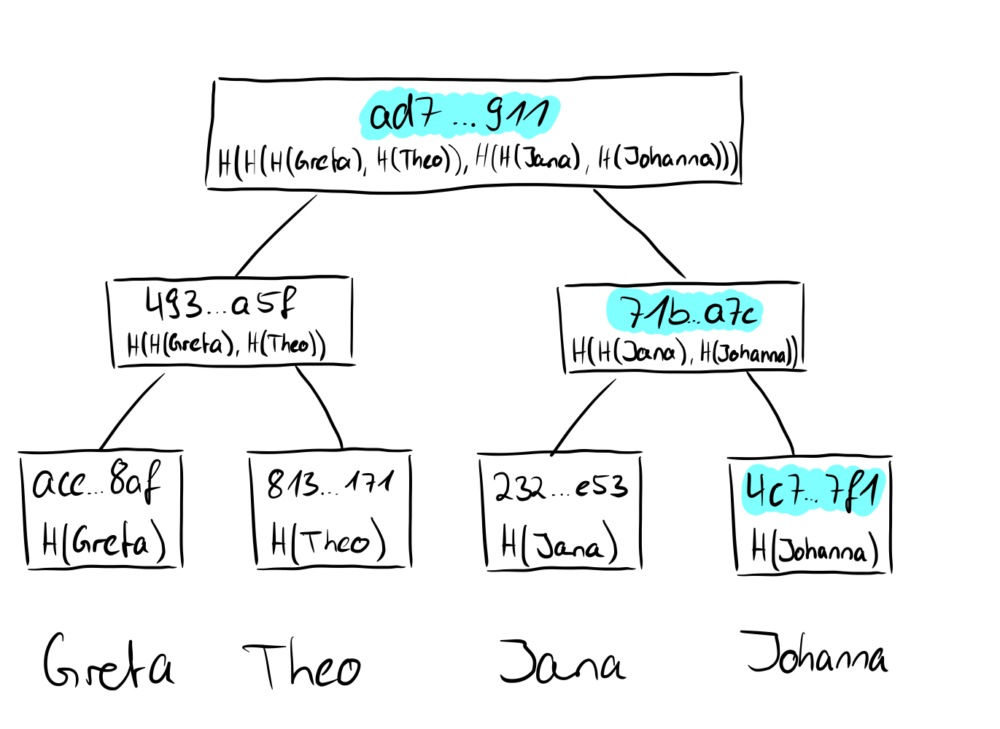

# Cryptographic commitments

maybe for the crypto intro

We again imagine a scenario for cryptographic commtiments in which Alice and Bob interact with each other. Alice has a secret that she does not want to tell Bob. She hashes her secret and puts this secret in a safe, giving the key for the safe to Bob. This means that Alice cannot change the secret in the safe afterwards, so she is bound to it (**= a cryptographic commitment scheme is binding**). Bob can open the safe at a later time and see the secret, but as we have seen above, Bob cannot determine anything else from the hashed secret (**= a cryptographic commitment scheme is hiding**). These are the required properties of a cryptographic commitment: they should bind to a value, i.e., they should not be modifiable afterwards, and they should say nothing about the value to which one has committed.

> Informally speaking, a cryptographic commitment scheme enables a sender to commit itself to a value by sending a short commitment and then later reveal the value such that the commitment scheme is binding (i.e., the sender cannot reveal a value different from what it originally committed), and hiding (i.e., a commitment does not reveal anything about the committed value).

If we now consider how the root of a Merkle tree behaves from these points of view, we take another step forward. We have seen that in the tree above the hashes of the names Greta, Theo, Jana, and Torben were stored in the leaves and then hashed together in pairs upwards until only one hash remains, which then represents the root of the Merkle tree. If we replace the value of the leaf "Torben" (SHA256 value: *d38f...d39*) with the value "Johnanna" (SHA256 value: *4c7...7f1*), obviously not only the value of the leaf changes, but also all other values on the way from the leaf to the root and the root itself.

This means that we are **bound** by the root to the values of the individual leaves and if we only have the root, we have no idea which actual values or leaves are present in the Merkle tree, so they are **hidden** (binding and hiding). Long story short: the root of a Merkle tree is excellent for a cryptographic commitment.
So now that we understand cryptographic commitments, we can look at what the proofs of membership or non-membership look like in Merkle trees.
