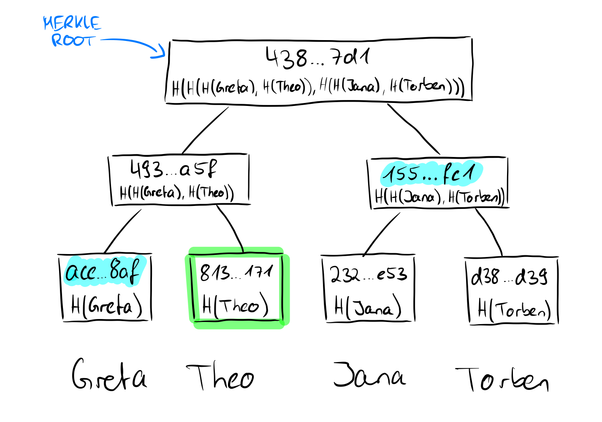
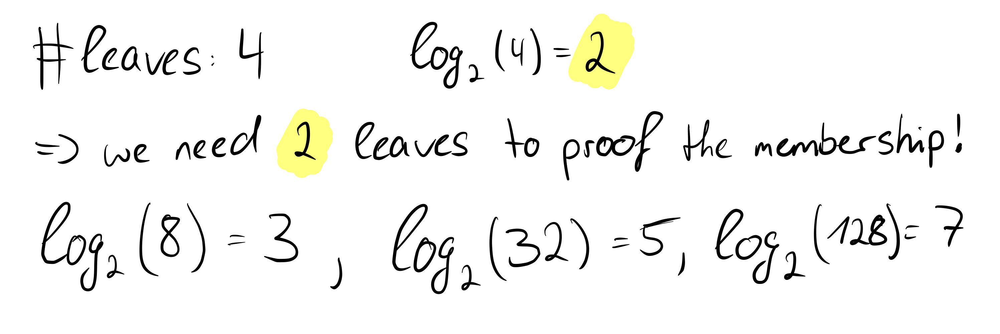

# Proof-of-Membership

We already know that the roots of the Merkle tree are in some sense a recursive computation of the hashes of the leaves. So we don't need exact knowledge about the leaves, only about their hashes. More precisely, for a membership proof (which is possible in any kind of Merkle tree, as already mentioned) we need the hashes of the sibling nodes on the way to the root.

Here we want to prove that the value "Theo" is contained in the tree. Since we know the value and we know that the hashes are created using the SHA256 hash function, we can calculate the hash value of Theo on our own. We said that we need the non-computable sibling nodes on the way to the root, and we have no way to come up with the value "Greta" because we don't know the other leave values, just the hashes. In our proof, we need to provide the hash of the value "Greta" for a proof that the root is correct. Since we now have the hash values of "Greta" and "Theo", we can calculate the parent node of the two. Uncomputable on the other hand is now again the sibling node of the parent node of "Greta" and "Theo", which we must bring again in the proof. This node is at the same time for the tree with four leaves the last necessary node to show the correctness of the root, because we can now calculate the root with the calculated parent node of "Greta" and "Theo" as well as its sibling node. What may not look very powerful in this small example is very powerful for larger trees, because mathematically speaking we only need *log n* nodes instead of the number of nodes (n) to prove the correctness of the root of the Merkle tree.

We see that in our example we actually need two leaves to prove the correctness of the root. Even if the number of leaves increases rapidly, with each further doubling only one more hash value is needed to prove the correctness of the root. This is an important and great property of Merkle trees and we can formally state:
***The time complexity of proof-of-membership in Merkle trees is O(log n)***.
