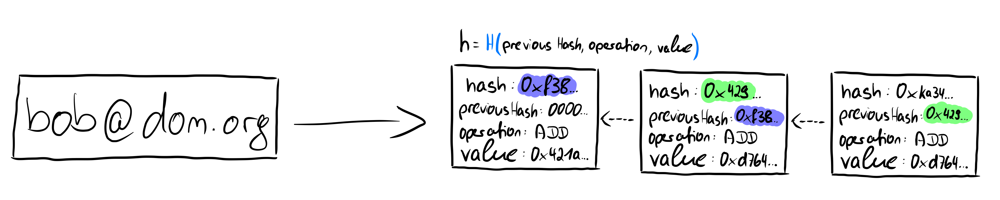

# Prism Datastructures

We will now look at the basic data structures of Prism and how they are used. Following this, we can understand how these data structures enable us to track provably correct behavior. The main data structures we introduce here are [append-only hashchains](#append-only-hashchains) and [Jellyfish Merkle Trees](#jellyfish-merkle-trees).

## Append-only hashchains

[Verdict](https://eprint.iacr.org/2021/1263.pdf) provides a good introductory definition of append-only hashchains:

> In Verdict's transparency dictionary, the value associated with a label is an append-only hashchain of operations, where nodes store raw operations requested on the label, as well as the cryptographic hash of the previous node in the chain. For example, in the context of key transparency, a hashchain records two types of operations: (1) adding a new key; and (2) revoking an existing key [...]

However, they do not provide a reference implementation. An implementation would conceivably include the following values:

- **hash**: the following three elements are hashed in a hash function and the value is stored in this field
- **previous hash**: a unique reference to the previous entry in the list, which depends on the contents of the entry as it contains the hashed values.
- **operation**: The executed operation, in our concrete application case ADD and REVOKE operations can be executed.
- **value**: Since we are still dealing with public keys, we need to know which keys are added or revoked in order to generate a list of valid, unrevoked keys from the operations.

Users can register a unique ID in Prism using various account sources, not just limited to email addresses. Any number of additional public keys can then be added, and keys that have already been added can be revoked. The prerequisite for adding new keys or revoking existing keys is that the operation has been signed with a private key associated with some unrevoked public key of that ID.

The image above shows an example of a hash chain. An identifier refers to this hash chain. The individual elements of the hash chain contain the operation performed and the value that is added or revoked with the operation. In addition, each element contains a previous hash value, which makes the data structure a chain, since each element points to its predecessor. The first element of the hashchain has 0000... as its previous hash, which is comparable to a genesis block of a blockchain. Each element of the hashchain is uniquely identifiable by a hash value. This is created by giving all other values of the element into a hash function H: _H(previous Hash, operation, value) = hash_

## Jellyfish Merkle Trees

Prism uses Jellyfish Merkle Trees (JMT) instead of indexed Merkle trees. JMTs are a space-and-computation-efficient sparse Merkle tree optimized for Log-Structured Merge-tree (LSM-tree) based key-value storage.

Key features of Jellyfish Merkle Trees include:

1.  Version-based Node Key: JMT uses a version-based key schema, which facilitates version-based sharding, reduces compaction overhead in LSM-tree based storage engines, and results in smaller key sizes on average.

2.  Simplified Structure: JMT has only two physical node types - Internal Node and Leaf Node.

3.  Concise Proof Format: The number of sibling digests in a JMT proof is less on average than that of the same Addressable Radix Merkle Tree (ARMT) without optimizations, requiring less computation and space.

4.  Efficient for Sparse Trees: JMT is particularly efficient for sparse trees, which is often the case in blockchain applications.

[More about Merkle trees](/quick-crypto#merkle-trees)

## Account Creation

Prism introduces a `CREATE_ACCOUNT` operation that allows for decentralized account creation. This operation supports various account sources, not just email addresses. The process works as follows:

1.  Users prove ownership of a resource (e.g., a social media account, email address) using services like TLSNotary or zkEmail.
2.  The proof is generated off-chain and then submitted as part of the `CREATE_ACCOUNT` operation.
3.  The Prism protocol includes validity rules for each supported external protocol's proof system.
4.  Full nodes verify the `CREATE_ACCOUNT` operation according to the corresponding proof system's ruleset before applying the state transition in the Jellyfish Merkle Tree.

This approach allows for:

-   Addition of arbitrary account sources
-   Decentralized account creation without relying on a single trusted entity
-   Flexibility for applications to use various types of accounts for registration

> **Note**: The `CREATE_ACCOUNT` operation enhances the security and decentralization of the account creation process in Prism. It mitigates the risks associated with centralized account creation while allowing for diverse account sources.

The combination of append-only hashchains and Jellyfish Merkle Trees, along with the decentralized account creation process, enables Prism to maintain a transparent and verifiable record of public keys associated with user IDs from various sources.
