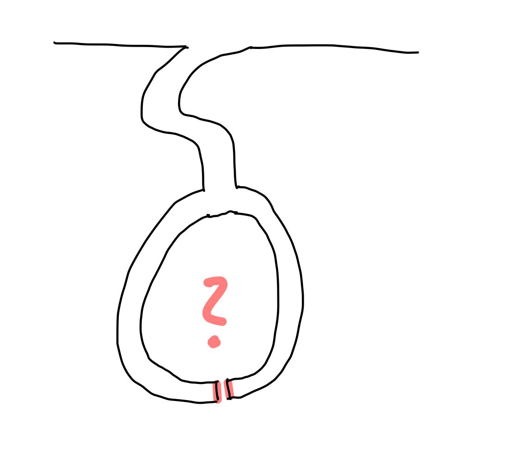

# Informal Zero-Knowledge Proofs

Superficially considered and informally speaking, a Zero-Knowledge Proof (ZKP) is a proof where a prover demonstrates the validity of a statement to another party (the verifier) without revealing any information about the statement itself. Thus, the verifier learns nothing but the fact that the statement is true. In the following, we will briefly explore the development of ZKPs and take a closer look at the concepts behind them. Many of the later elaborated concepts are well-presented in Jean-Jacques Quisquater's "[How to explain Zero-Knowledge Protocols to your children](http://bitcoin-class.org/classes/zkforkids.pdf)", which I will summarize and expand upon below. If everything is not entirely clear at first, that is perfectly normal. As the descriptions progress, things should become clearer.

## Ali Baba and the forty thieves

Quisquater bases his illustration on the adventure film "Ali Baba and the Forty Thieves". Ali Baba goes to the market every day and is robbed in some way by a thief, forty times in a row. Each time, the thieves flee to a cave, which, after its entrance, contains a hidden fork (meaning that one cannot see which path a person takes in the cave from the entrance) and one can turn either left or right.

Ali Baba follows the thieves each time but cannot see which path the respective thief takes, as he arrives at the cave a little too late. Therefore, he has to make a decision on which pursuit path to take. Since it appears that the fork leads to a dead end, he sees a 50-50 chance of catching the thief. However, he is unsuccessful every time, leading him to doubt that the thieves are so lucky as to always choose the path he coincidentally does not choose (for 40 thieves, the probability is 1 in 1 trillion (1/2^40 = 1/1,099,511,627,776), so in practical terms, it is impossible for him to always make a random mistake. There must be a secret, and the thieves **prove** to Ali Baba each time that he has **zero knowledge** of this secret.

> **Note**
> This number is so close to zero that it can be considered zero in practice.
> This is referred to as statistical security. It is then generally referred to
> as having a negligible probability that an attacker can overcome a security
> system.

## The Zero-Knowledge Proof in a new experimental setup

In the subsequent descriptions by Quisquater et al., the contemporary scientific interest in the story is outlined. They present a scenario in which a scientist, referred to as Mick Ali (a supposed descendant of Ali Baba), also knows the secret and is supposed to demonstrate it. The setup of a typical zero-knowledge proof is further emphasized: a prover (in this case, Mick Ali) wants to prove that he knows a secret, but he does not want to reveal the secret itself (more precisely, he wants to show nothing more than his knowledge of the secret). To accomplish this, a film crew records the cave, clearly demonstrating the apparent dead-end, and then films the entrance. Mick Ali subsequently enters the cave alone, while outside, a reporter flips a coin (a random event) and demands that Mick Ali, who has chosen one of the two paths, return through either the left or the right path, depending on the coin toss outcome. Depending on the side of the coin (heads means Mick should return from the right path, tails means he should return from the left path), the reporter demands Mick's return route.  
This experiment is repeated 40 times and in all 40 cases Mick returns through the desired path. It could be a coincidence that Mick happened to choose the path he was supposed to return through during the first trial, fulfilling the coin-flipping reporter's request without knowing the secret. The probability of this occurring in the first trial is 1/2. The likelihood of Mick experiencing this luck in the second trial is 1/4 (1/2\*1/2), and in the fortieth trial, the probability is 1/2^40, which is slightly more than 1/1 trillion, effectively zero. Mick proves that he knows the secret, as it does not matter which of the two paths he takes; he can either return through the same path or use the secret to open the door connecting the two paths and simply return through the other path.

## The simulator paradigm

Following the initial discussion, the Simulator Paradigm is further elaborated. In the context of the narrative, another reporter inquires if Mick Ali would be available for additional filming with the camera crew to create a report. Mick Ali declines, stating that it is possible to reproduce the scenario without knowledge of the secret by merely editing video sequences. As a result, the subsequent reporter introduces an individual to the scene who lacks knowledge of the secret. The experimental setup remains consistent; the only difference is that the test subject can only return via the correct path if the reporter randomly selects the return path previously taken by the test subject, as the absence of secret knowledge precludes returning through the alternative path. The expected real-world outcome is described: the test subject consistently chooses the undesired path and is unable to fulfill the reporter's request. These scenes are subsequently excised from the final report, creating the illusion that the test subject possesses knowledge of the secret, as they appear to meet all the reporter's requirements.

In the realm of Zero-Knowledge Proofs, the Simulator Paradigm is a critical property frequently used for their definition. Put simply, this paradigm asserts that a proof is zero-knowledge (i.e., revealing no information about the secret) if a simulator exists that can generate indistinguishable results without possessing knowledge of the secret. Consequently, the verifier acquires no new knowledge through the proof.

> **Note**
> If a simulator is able to produce a proof that is indistinguishable to the
> verifier from a real proof, the zero-knowledge property is considered to
> exist.

This concept aligns with Quisquarter's explanation, which suggests that the video sequences (i.e., Mick Ali's original video, where he is aware of the secret, and the subsequent reporter's video, where the test subject lacks knowledge of the secret and the footage is edited) can be compared in a court of law. Following this comparison, the court would be unable to ascertain which party genuinely possesses knowledge of the secret.

## Summary

In "How to Explain Zero-Knowledge Protocols to Your Children," additional ideas and concepts related to the protocols and various types are outlined. For example, one notion is that the second reporter and the unknowledgeable prover (or the simulator) could agree beforehand on the path to be taken, subsequently requiring fewer sequences to be cut or, at the very least, needing to falsify the coin toss. We briefly discuss this approach because it might be an immediate consideration; however, the intriguing idea that zero-knowledge properties can be preserved even when the prover and verifier collude, as well as other ideas from the text, will be examined in greater detail later in this paper.

We will now recap the proof scenario:  
A person (or an algorithm; the prover) wants to prove to another person (or another algorithm; the verifier) that they know a secret and reveal nothing more than the information that they possess this secret. There is a cave with a fork and two dead ends leading to a gate that can only be opened with a secret. The verifier stands at the entrance of the cave while the prover enters the cave and selects a path (left or right). The verifier cannot observe this decision and only enters the cave after the prover has chosen a path. The verifier then tosses a coin (a random event), and depending on the coin toss outcome, asks the prover to return via a specific path. This scenario is repeated frequently so that the probability of the prover randomly choosing the path requested by the verifier can be statistically ruled out. If the prover can always follow the requested path, it is proven that they know the secret to open the door without revealing anything further about the secret except for the prover's knowledge.

In the following sections, we will move away from the highly simplified explanations and examine other concepts in a more formal manner.
