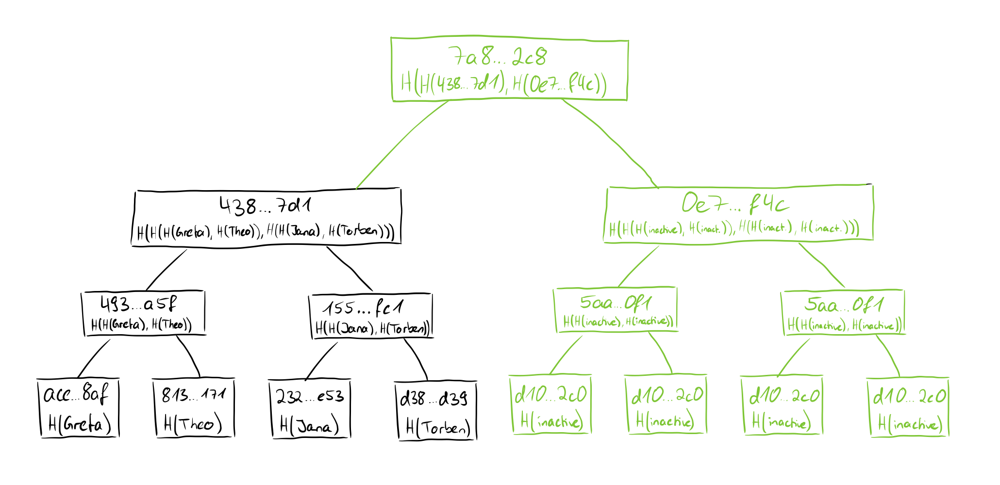
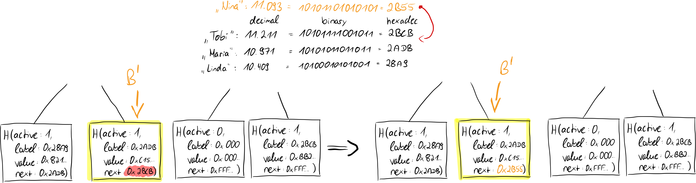
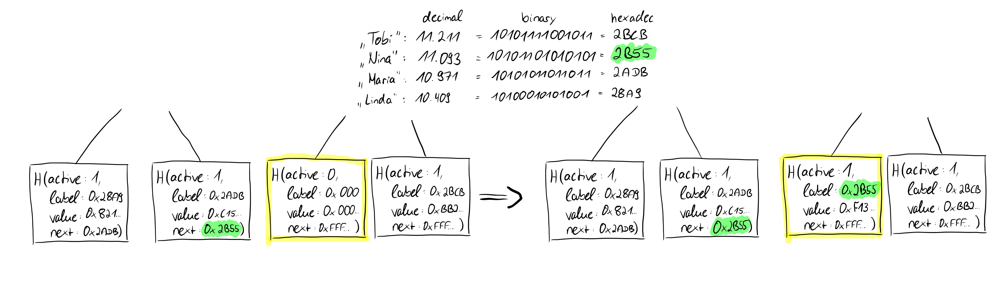

# Adherance to application-specific guidelines

We recall at this point that we want to prove that a specified policy has been followed, which includes, among other things, that the labels grow monotonically. Since in *Prism* only insert or update operations are allowed (i.e. one can only add new email addresses or add or revoke public keys to an existing email address), the monotonic growth of the labels should be achieved if the behavior is correct.

## Versioning

JMT incorporates versioning, which is crucial for its operations. Each update to the tree creates a new version, allowing for efficient historical queries and updates. The version is part of the node key structure:

```bash
version || nibble path
```

This versioning system ensures that updates can be made efficiently without affecting previous versions of the tree.

## Proof-of-Update

Let's start with the proof that an update operation was executed correctly, i.e. a proof-of-update. Informally speaking, an update means that the operation list (hashchain) for an already existing identifier has been updated by one operation. For example, an already existing key could be revoked or a new public key could have been added for the respective identifier. In any case, this means that another entry has been added to the hashchain in which the operations are stored.

> **Note**
> Obviously, this means that the last hash of the hashchain, which is crucial for the label-value pair in the Merkle tree, also has a new value.

The value of the leaf of the Merkle tree changes, but the index of the leaf remains the same, because it depends on the identifier (the e-mail address). When a leaf is updated, its value changes, but its position in the tree (determined by its key, e.g. the hashed email address) remains the same. This is because the key determines the position of the leaf. We know that when the input to a hash function changes, the output also changes. Since the "value" field is part of the input of the hash of the leaf, the hash of the leaf changes accordingly.
To proof the update, it is sufficient if we consider the old root (the cryptographic commitment) and perform a proof-of-membership before the value was updated, with the "old" leaf, so to say. The verification of the proof then involves performing a proof-of-membership of the leaf with the updated value and using this to calculate the new root and compare it with the current root.

In Jellyfish Merkle trees, a new version of the tree is created with each update, enabling efficient history recording while maintaining the integrity of previous states. This versioning system ensures that updates can be tracked and verified across different states of the tree and also allows reuse of unmodified parts, which helps to increase efficiency. Accordingly, when updates are made, all nodes along the updated path are given a higher version, so the verifier needs to know which version to check the update against.

## Proof-of-Insert

The insert operation comprises several steps, which we will consider individually in the following. First, again informally: what does it mean to perform an insert operation? Insert means that we add a completely new identifier - so we add a "new" email address to our dictionary. Accordingly, when we add a value to the dictionary, the structure that supports us in any reasoning changes as well, namely our indexed Merkle tree that manages the derived dictionary.

### Find an inactive leaf

In the first step of the insert operation, we need to distinguish between two scenarios. Since we cannot keep an infinite number of leaves free in the Merkle tree, we had to specify a certain number of leaves at the beginning, during creation. Before initialization, all leaves were added as empty leaves according to the strut cure described above. So we first need to find an empty leaf, and depending on the state of the dictionary and the number of leaves in the Merkle tree, it may be that all leaves are occupied. If this is not the case, an inactive or empty leaf is simply selected at random and we can proceed to the second step. However, if this is the case, we must first increase the capacity in the tree, or more precisely, double it. We illustrate the doubling process with this sketch:



We can see that we create a completely empty tree with the same number of leaves as the currently existing tree and calculate all hash values in it pairwise up to the root as usual. Then we have two trees of the same size, which we can join by hashing the root of the left tree with the root of the right (completely empty) tree, thus in a sense computing a common Merkle root. This way we merge the two trees and now have a new tree with doubled capacity and many empty leaves, from which we can now choose one to continue with the insert operation. Performing these calculations is no problem in so far as we know the structure of the inactive leaves (< active = 0, label = 0x000...00, value = 0x000...00, next = 0xFFF...FF >) and since all leaves are the same we can quickly calculate all hash values. For each level in the tree only one calculation is necessary. So now we have an empty leaf selected and we are looking at the label-value to be added.

### Why uniqueness matters

> Non-membership queries are important [...] as well; otherwise, the service's dictionary might contain more than one tuple for the <bob@dom.org> label, allowing the service to show different tuples to different clients. [...] Alice can safely encrypt sensitive data using the public key the service returns for Bob.

We briefly recall what the unique identifier means and why this is important. The email addresses in *Prism* act as unique identifiers and in order for the service to behave correctly, it must be ensured that no email address can be inserted twice. We imagine scenarios including when the Id <bob@dom.org> appears twice or more in the dictionary:
Bob adds multiple keys and also revokes some of those keys. If there are several entries for <bob@dom.org>, scenarios are conceivable in which Bob adds a key to his first entry '<bob@dom.org>' and later has to revoke it because the corresponding private key was stolen by Oskar. Now it could happen that the revoke operation is entered in the hashchain of the second entry '<bob@dom.org>', in which the add operation of this key doesn't occur. Now when Alice goes through the operations in the first entry '<bob@dom.org>', she will find that the stolen key has not been revoked and she thinks that she can perform encryption with this key. Since a requirement of Verdict is that we rule out these scenarios (as best we can), accordingly we need to make use of Proofs-of-Non-Membership for this.

### Update existing leaf

Since the identifiers must be unique, we must first prove in this step that the label does not yet exist in the tree, for which a proof-of-non-membership is of course excellent. By this proof, we incidentally ensure that it is correctly an insert operation and that we should not have mistakenly performed an update operation. We have also now, through the proof-of-non-membership, identified the leaf node in the current tree, the place includes where the new value must be inserted, we'll call this leaf B' for now. Since the next pointer of B' points to a label, which is greater than the value of the label we want to add, we now need to update the value of the next pointer of B' to the new label.



This is an update operation of an existing leaf as we already know it (we only updated the next value instead of the value, but this also results in a change of the hash of the leaf, since this hash depends on all values), so we prove this step with a proof-of-update.

### Update empty leaf

In the last step, we deal again with the inactive leaf that was previously made out. We update the leaf as follows, from:
*< active = 0, label = 0x000...00, value = 0x000...00, next = 0xFFF...FF >* to
*< active = 1, label = new-label, value = new-value, next = old-next-pointer from B' >*
As we noted earlier, the label of the new leaf was between the label and the next pointer of leaf B'. Since we updated the next pointer of B' to label l of the new leaf, we need to set the next pointer of the new leaf to the previously valid value of B'. Since at this point we are now dealing with an update operation of a previously inactive leaf, we again perform a proof-of-update to prove the correctness of this step.



Thus, we note that a proof-of-insert in its constituent parts consists of a proof-of-non-membership and two successive proof-of-updates. The proof-of-non-membership is particularly important because we want to ensure that no identifier occurs more than once. This is relevant for various reasons, but not least for security reasons. This way, users of the service can be sure that they have the only correct and valid list of public keys for the owner of the identifier they want to interact with.
