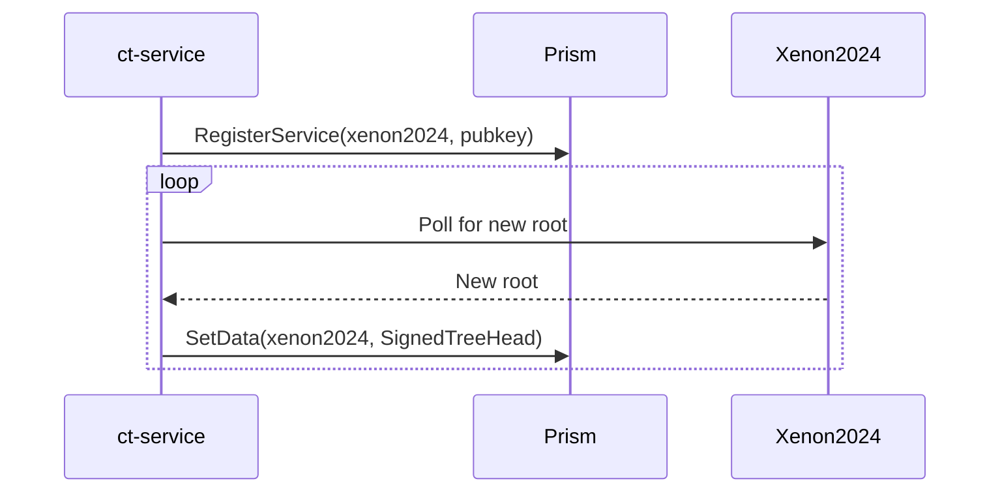
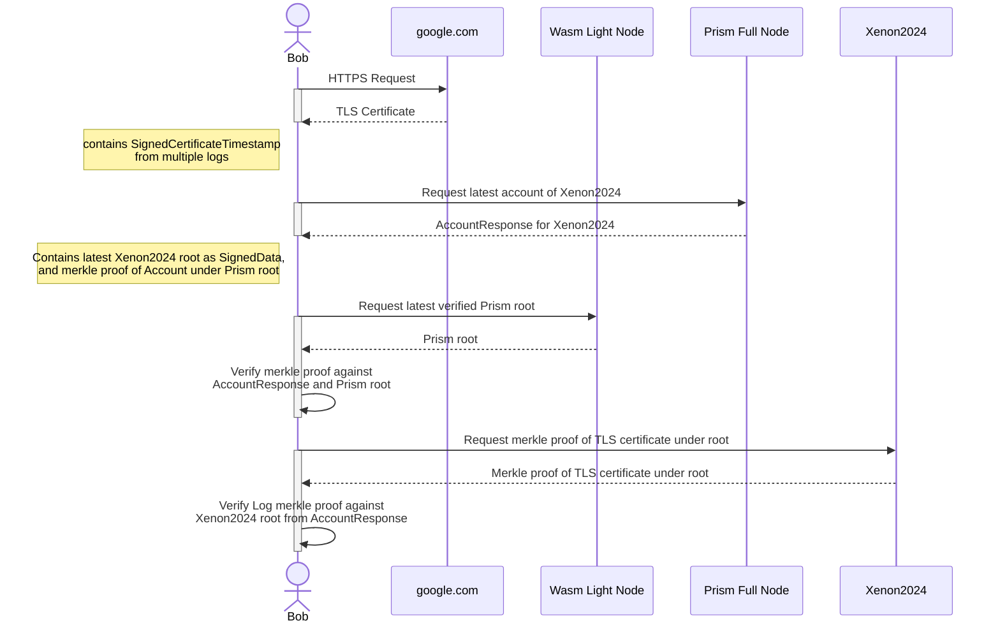

# Idea 1: Certificate Transparency Browser Extension

## Problem
Certificate transparency (CT) was designed to allow users to directly verify TLS certificates and ensure secure connections. However, the current system relies heavily on the honesty of log operators, introducing vulnerabilities and a lack of trust in end-to-end encryption.

The hackathon track addresses this gap by building a browser extension that restores user trust in TLS verification and enhances online security.

[This](https://x.com/distractedm1nd/status/1842159919082176689) twitter thread highlights the current problems with certificate transparency that your project will aim to solve.

We have already built this internally as a prototype, so please [reach out](https://telegram.me/distractedm1nd) with any questions that come up.
This document intends to only be a rough outline of the architecture and flow of the project.

## Solution
The browser extension consists of two parts:
1. A prism service that monitors the CT logs for new roots and stores them in prism accounts corresponding to each log
2. A browser extension that retrieves the logs' accounts depending on the certificates of the websites visited by the user

### Prism Service

### Browser Extension

## Resources
- [Rust CTClient](https://docs.rs/ctclient/latest/ctclient/)
