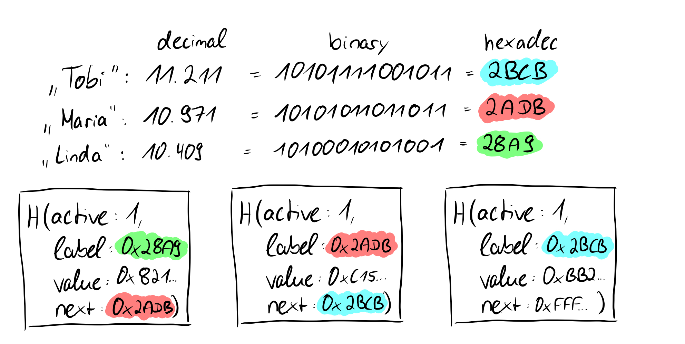

# Merkle Proofs

A distinguishing aspect of indexed Merkle trees is that they support both efficient membership proofs and non-membership proofs.

We've illustrated how the individual leaves work, but we haven't yet discussed why this construction is chosen in the first place. Prism uses an IMT specifically to create membership and non-membership proofs efficiently.

Such proofs are not unique to *indexed* Merkle trees. Membership proofs can also be generated with simpler Merkle trees. A sparse merkle tree, for example, has similar properties but is not used because of the increased height, which is less efficient to SNARK over.

We need the next-pointer construction (which points to labels that act as sortable indexes) to be able to address leaves directly and to create proofs that certain leaves do not exist in the tree. What sounds a bit complicated now will become clearer in a moment, again with the help of an example.

## Cryptographic commitments

We again imagine a scenario for cryptographic commtiments in which Alice and Bob interact with each other. Alice has a secret that she does not want to tell Bob. She hashes her secret and puts this secret in a safe, giving the key for the safe to Bob. This means that Alice cannot change the secret in the safe afterwards, so she is bound to it (**= a cryptographic commitment scheme is binding**). Bob can open the safe at a later time and see the secret, but as we have seen above, Bob cannot determine anything else from the hashed secret (**= a cryptographic commitment scheme is hiding**). These are the required properties of a cryptographic commitment: they should bind to a value, i.e., they should not be modifiable afterwards, and they should say nothing about the value to which one has committed.

> Informally speaking, a cryptographic commitment scheme enables a sender to commit itself to a value by sending a short commitment and then later reveal the value such that the commitment scheme is binding (i.e., the sender cannot reveal a value different from what it originally committed), and hiding (i.e., a commitment does not reveal anything about the committed value).

If we now consider how the root of a Merkle tree behaves from these points of view, we take another step forward. We have seen that in the tree above the hashes of the names Greta, Theo, Jana, and Torben were stored in the leaves and then hashed together in pairs upwards until only one hash remains, which then represents the root of the Merkle tree. If we replace the value of the leaf "Torben" (SHA256 value: *d38f...d39*) with the value "Johnanna" (SHA256 value: *4c7...7f1*), obviously not only the value of the leaf changes, but also all other values on the way from the leaf to the root and the root itself.

This means that we are **bound** by the root to the values of the individual leaves and if we only have the root, we have no idea which actual values or leaves are present in the Merkle tree, so they are **hidden** (binding and hiding). Long story short: the root of a Merkle tree is excellent for a cryptographic commitment.
So now that we understand cryptographic commitments, we can look at what the proofs of membership or non-membership look like in Merkle trees.

## Proof-of-Membership

We already know that the roots of the Merkle tree are in some sense a recursive computation of the hashes of the leaves. So we don't need exact knowledge about the leaves, only about their hashes. More precisely, for a membership proof (which is possible in any kind of Merkle tree, as already mentioned) we need the hashes of the sibling nodes on the way to the root.

Here we want to prove that the value "Theo" is contained in the tree. Since we know the value and we know that the hashes are created using the SHA256 hash function, we can calculate the hash value of Theo on our own. We said that we need the non-computable sibling nodes on the way to the root, and we have no way to come up with the value "Greta" because we don't know the other leave values, just the hashes. In our proof, we need to provide the hash of the value "Greta" for a proof that the root is correct. Since we now have the hash values of "Greta" and "Theo", we can calculate the parent node of the two. Uncomputable on the other hand is now again the sibling node of the parent node of "Greta" and "Theo", which we must bring again in the proof. This node is at the same time for the tree with four leaves the last necessary node to show the correctness of the root, because we can now calculate the root with the calculated parent node of "Greta" and "Theo" as well as its sibling node. What may not look very powerful in this small example is very powerful for larger trees, because mathematically speaking we only need *log n* nodes instead of the number of nodes (n) to prove the correctness of the root of the Merkle tree.

We see that in our example we actually need two leaves to prove the correctness of the root. Even if the number of leaves increases rapidly, with each further doubling only one more hash value is needed to prove the correctness of the root. This is an important and great property of Merkle trees and we can formally state:
***The time complexity of proof-of-membership in Merkle trees is O(log n)***.

## Proof-of-Non-Membership

Now that we have learned about proof-of-memberships, let's look at the way we can prove that elements are not present in a Merkle tree, called proof-of-non-membership. To do this, let's take another look at the leaf structure of Verdict's Merkle trees using the familiar, simplified example.

We recall that in Verdict the leaves consist of the hash of the quadruple *< active, label, value, next >*. Verdict has a label, the identifier hashed with SHA256 from the label value map, in addition to the active flag. When hashing a string with SHA256, a 256 bit or 32 byte value will come out. The 256 binary bits or 32 bytes in hexadecimal can also be converted to decimal as shown earlier in the picture using a simplified example with small numbers, in which system the sorting is familiar to us. So we know that we can turn any document, string or whatever with SHA256 into a representation of a fixed length string, namely 256 bits (32 bytes). So not only does SHA256 give us the advantage that the cryptographic commits and the values within a leaf node are always the same length, but it also gives us comparable or rather sortable numbers. Now it also makes a bit more sense why in the construction of Verdict the last node points to 64 "F"'s in hexadecimal or 256 "ones" in binary, this is, so to speak, the "highest possible number" and thus in a sense set as the "end".

### There is a different element sitting in our seat

So all email addresses hashed in the Merkle tree are sortable, the next pointer points to the next largest hash value, if you like to the "next largest email address". If we now want to prove that an element is not present in the Merkle tree, we first look at the hash value of the email address and we know from the paper that the values can be sorted. By this sorting we can find the place where the element or the label would find its place in *O(log n)* with the help of the binary search. However, since at this point we encounter an element whose label will be smaller than the label of the non-existent element and whose next pointer is larger, we can be sure that the element is not present in the tree due to the "Rule 2" (*there is an active leaf to whose label the next pointer points and there is no other active leaf in between*) presented earlier.

## What's next?

We now know how proof-of-memberships are enabled in general and how proof-of-non-memberships are enabled in the specific use case of Verdict. In the next section, we will look at what we can do with them.
