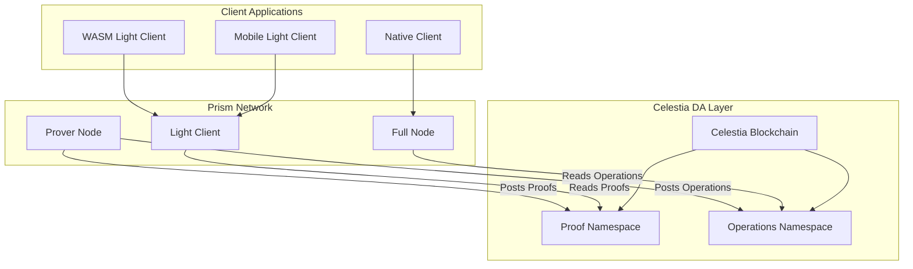
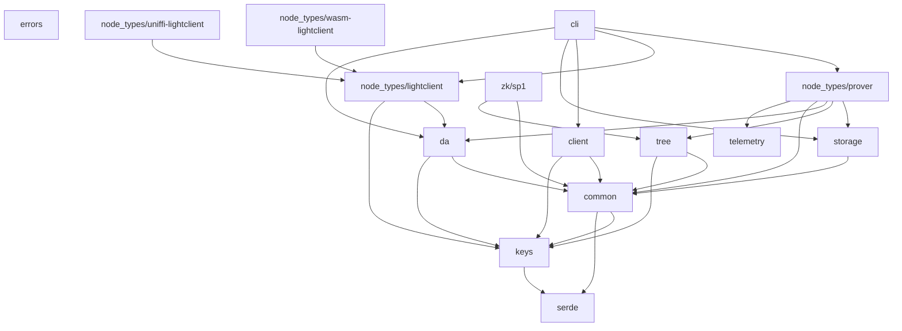

# Prism Developer Onboarding Guide

Welcome to Prism! This guide will help you understand the codebase architecture, key concepts, and how to contribute effectively to the project.

## Table of Contents
- [Project Overview](#project-overview)
- [Architecture Overview](#architecture-overview)
- [Crate Structure](#crate-structure)
- [Key Concepts](#key-concepts)
- [Development Workflow](#development-workflow)
- [Testing](#testing)
- [Contribution Guidelines](#contribution-guidelines)

## Project Overview

Prism is a **decentralized key transparency protocol** that operates as a sovereign rollup on Celestia. It enables trust-minimized verification of cryptographic materials (keys, certificates) without relying on trusted intermediaries.

### What Problem Does Prism Solve?

Traditional cryptographic authentication relies on trusted intermediaries (CAs, key servers) that create "split-world" vulnerabilities—malicious actors could show different security credentials to different users without detection. Prism eliminates this by providing a transparent, verifiable key directory backed by zero-knowledge proofs.

### Key Features
- **Trust-minimized**: Direct cryptographic verification without intermediaries
- **Transparent**: All key operations are publicly auditable
- **Scalable**: Based rollup architecture on Celestia
- **Multi-platform**: Supports native, WASM, and mobile deployments
- **ZK-powered**: Uses SP1 zero-knowledge proofs for efficient verification

## Architecture Overview



### Node Types

1. **Prover**: Singleton node that generates ZK proofs and sequences transactions
2. **Full Node**: Processes all operations and maintains full state
3. **Light Client**: Verifies proofs without full state, runs on end-user devices

### Data Flow

1. Users submit operations (create account, add key, etc.) to Prover
2. Prover batches operations into epochs and generates SP1 ZK proofs
3. Proofs and operations are posted to separate Celestia namespaces
4. Full nodes process operations to maintain state
5. Light clients verify proofs to get trusted state commitments

## Crate Structure

The Prism codebase is organized into several focused crates. Here's the dependency graph:



### Core Infrastructure Crates

#### `errors` - Centralized Error Handling
```rust
pub enum PrismError {
    General(GeneralError),
    Database(DatabaseError),
    DataAvailability(DataAvailabilityError),
    Proof(ProofError),
}
```
- **Purpose**: Provides structured error types for the entire project
- **Key Types**: `PrismError`, `GeneralError`, `DatabaseError`, etc.
- **Usage**: Use `PrismError` for all error handling across crates

#### `serde` - Serialization Utilities
```rust
pub fn raw_or_hex<S>(data: &[u8], serializer: S) -> Result<S::Ok, S::Error>
pub fn raw_or_b64<S>(data: &[u8], serializer: S) -> Result<S::Ok, S::Error>
```
- **Purpose**: Context-aware serialization (binary for internal, human-readable for external)
- **Key Features**: Base64, hex, bech32, and binary encoding
- **Usage**: Use for consistent data serialization across APIs

#### `telemetry` - Observability
- **Purpose**: Metrics collection and distributed tracing
- **Key Types**: Metrics registry, telemetry initialization
- **Usage**: Instrument code with metrics and tracing for monitoring

### Cryptographic Layer

#### `keys` - Cryptographic Operations
```rust
pub enum CryptoAlgorithm {
    Ed25519,
    Secp256k1,
    Secp256r1,
    EIP191,
    CosmosAdr36,
}

pub struct SigningKey { /* ... */ }
pub struct VerifyingKey { /* ... */ }
pub struct Signature { /* ... */ }
```
- **Purpose**: Multi-algorithm cryptographic key management
- **Key Features**: Key generation, signing, verification, PKCS#8 serialization
- **Supported Algorithms**: Ed25519, Secp256k1, Secp256r1, Ethereum EIP-191, Cosmos ADR-36

### Core Data Structures

#### `common` - Business Logic
```rust
pub struct Account {
    pub id: String,
    pub public_keys: BTreeMap<String, VerifyingKey>,
    pub service_signing_key: VerifyingKey,
    pub data: Vec<u8>,
    pub nonce: u64,
}

pub enum Operation {
    CreateAccount { id: String, key: VerifyingKey, data: Vec<u8> },
    AddKey { id: String, key: VerifyingKey },
    RevokeKey { id: String, key_hash: String },
    UpdateData { id: String, data: Vec<u8> },
}

pub struct Transaction {
    pub id: String,
    pub operation: Operation,
    pub signature: SignatureBundle,
    pub signature_bundle: SignatureBundle,
}
```
- **Purpose**: Core business objects and transaction types
- **Key Types**: `Account`, `Operation`, `Transaction`, `SignatureBundle`
- **Usage**: Foundation for all account and transaction operations

#### `tree` - State Management
```rust
pub struct KeyDirectoryTree {
    tree: Arc<Mutex<JellyfishMerkleTree<...>>>,
}

pub enum AccountResponse {
    Found(Account, MerkleProof),
    NotFound(MerkleProof),
}
```
- **Purpose**: Merkle tree-based state management with cryptographic proofs
- **Key Features**: Jellyfish Merkle Tree, inclusion/exclusion proofs
- **Usage**: State operations with zero-knowledge proof generation

### Storage Layer

#### `storage` - Database Abstraction
```rust
pub trait Database: Send + Sync {
    async fn get_commitment(&self, epoch: u64) -> Result<Option<Digest>, PrismError>;
    async fn set_commitment(&self, epoch: u64, commitment: Digest) -> Result<(), PrismError>;
    // ... more methods
}

pub enum StorageBackend {
    RocksDB,
    InMemory,
    Redis,
}
```
- **Purpose**: Database abstraction supporting multiple backends
- **Supported Backends**: RocksDB (production), InMemory (testing), Redis (development)
- **Usage**: Persistence layer for epochs, commitments, and tree state

### Data Availability Layer

#### `da` - Celestia Integration
```rust
pub struct FinalizedEpoch {
    pub epoch: u64,
    pub proof: Vec<u8>,
    pub commitments_with_proofs: Vec<u8>,
    pub operations: Vec<Operation>,
    pub signature_bundle: SignatureBundle,
}

pub trait DataAvailabilityLayer {
    async fn get_finalized_epoch(&self, epoch: u64) -> Result<FinalizedEpoch, PrismError>;
    async fn submit_finalized_epoch(&self, epoch: FinalizedEpoch) -> Result<(), PrismError>;
}
```
- **Purpose**: Interface to Celestia blockchain for data availability
- **Key Features**: Submit/retrieve finalized epochs, transaction batching
- **Usage**: DA layer integration for rollup architecture

### Node Implementations

#### `node_types/prover` - Prover Node
```rust
pub struct Prover {
    pub db: Arc<dyn Database>,
    pub da_layer: Arc<dyn DataAvailabilityLayer>,
    pub tree: KeyDirectoryTree,
    pub prover_engine: ProverEngine,
    pub sequencer: Sequencer,
    pub syncer: Syncer,
}
```
- **Purpose**: Main sequencer and proof generator
- **Key Components**: `ProverEngine` (ZK proofs), `Sequencer` (batching), `Syncer` (DA sync)
- **Usage**: Processes transactions and generates proofs for epochs

#### `node_types/lightclient` - Light Client
```rust
pub struct LightClient {
    pub da_layer: Arc<dyn LightDataAvailabilityLayer>,
    pub verifying_key: VerifyingKey,
}
```
- **Purpose**: Lightweight verification without full computation
- **Key Features**: SP1 proof verification, state commitment tracking
- **Usage**: Embeddable in user applications for trust-minimized verification

#### `node_types/wasm-lightclient` - Web Integration
- **Purpose**: Browser-compatible light client
- **Key Features**: WASM bindings, Web Worker support
- **Usage**: Integrate Prism verification into web applications

#### `node_types/uniffi-lightclient` - Mobile Integration
- **Purpose**: iOS/Android compatible light client
- **Key Features**: Swift/Kotlin bindings via UniFFI
- **Usage**: Mobile app integration with native performance

### Zero-Knowledge Proofs

#### `zk/sp1` - SP1 Integration (Active)
```rust
// SP1 program for state transition verification
pub fn main() {
    let input: StateTransitionInput = sp1_zkvm::io::read();
    // Verify state transition logic
    let output = verify_state_transition(input);
    sp1_zkvm::io::commit(&output);
}
```
- **Purpose**: SP1 zero-knowledge virtual machine integration
- **Key Features**: State transition proofs, recursive proving
- **Usage**: Primary proof system for production

#### `zk/groth16` & `zk/nova` - Alternative Proof Systems (Experimental)
- **Purpose**: Handwritten circuits for comparison and research
- **Status**: Currently disabled in favor of SP1
- **Usage**: Research and benchmarking alternative approaches

### Client Libraries

#### `client` - HTTP Client
```rust
impl PrismHttpClient {
    pub async fn create_account(&self, request: CreateAccountRequest) -> Result<CreateAccountResponse, PrismError>;
    pub async fn get_account(&self, id: &str) -> Result<AccountResponse, PrismError>;
    // ... more methods
}
```
- **Purpose**: HTTP client for interacting with Prism nodes
- **Key Features**: Account management, transaction submission
- **Usage**: Application integration with Prism network

#### `cli` - Command Line Interface
- **Purpose**: Binary executable for running different node types
- **Usage**: `prism-cli prover`, `prism-cli light-client`, etc.
- **Configuration**: Supports various configuration options and environments

## Key Concepts

### Account Model
```rust
// Accounts store public keys and arbitrary data
let account = Account {
    id: "alice@example.com".to_string(),
    public_keys: BTreeMap::new(), // Multiple keys per account
    service_signing_key: verifying_key,
    data: user_data,
    nonce: 0,
};
```

### Operations
```rust
// All state changes are operations
let op = Operation::CreateAccount {
    id: "alice@example.com".to_string(),
    key: alice_public_key,
    data: vec![],
};
```

### Transactions
```rust
// Operations must be signed to become transactions
let tx = Transaction {
    id: "alice@example.com".to_string(),
    operation: op,
    signature: user_signature,
    signature_bundle: service_signature,
};
```

### Epochs
- **Definition**: A batch of operations processed together
- **Proof Generation**: Each epoch generates a ZK proof of correct state transition
- **DA Commitment**: Proofs and operations posted to Celestia

## Development Workflow

### Build Commands
```bash
# Build all crates
just build

# Run linting and checks
just check

# Run unit tests
just unit-test

# Run integration tests
just integration-test

# Generate coverage report
just coverage

# Install dependencies
just install-deps
```

### Running Tests
```bash
# Run a specific test with SP1 mock prover
SP1_PROVER=mock cargo test --lib --release -- test_name

# Run all tests
cargo test --workspace
```

### Local Development Setup
```bash
# Start local Celestia devnet
just celestia-up

# Run prover node
prism-cli prover

# Run light client (in another terminal)
prism-cli light-client --verifying-key <key-from-prover-logs>

# Run full node
prism-cli full-node --verifying-key <key-from-prover-logs>
```

### Code Style Guidelines
- Follow [Rust Coding Standards](https://doc.rust-lang.org/nightly/style-guide/)
- Use `rustfmt` with project settings (`merge_imports=true`, `max_width=100`)
- Create feature branches for development
- Write descriptive commit messages
- Include tests for new functionality
- Use `Result` types with descriptive error messages

## Testing

### Test Categories
1. **Unit Tests**: Test individual functions and modules
2. **Integration Tests**: Test interaction between components
3. **End-to-End Tests**: Test complete workflows

### Testing Best Practices
- Mock external dependencies (DA layer, storage)
- Use `SP1_PROVER=mock` for faster ZK proof testing
- Test error conditions and edge cases
- Use property-based testing where appropriate

### Test Utilities
```rust
// Common test utilities are available in prism-common
use prism_common::test_transaction_builder::TestTransactionBuilder;

let tx = TestTransactionBuilder::new()
    .with_operation(Operation::CreateAccount { ... })
    .build();
```

## Contribution Guidelines

### Before Contributing
1. Read the [CONTRIBUTING.md](CONTRIBUTING.md) file
2. Join the [Discord](https://discord.gg/eNTVVHYSw7) community
3. Look for "good first issue" labels on GitHub

### Development Process
1. **Fork and Clone**: Fork the repository and clone locally
2. **Branch**: Create a feature branch from `main`
3. **Develop**: Make changes following code style guidelines
4. **Test**: Run tests and ensure they pass
5. **Commit**: Write clear commit messages
6. **Push**: Push your branch and create a pull request

### Code Review Process
- All PRs require review from maintainers
- Address feedback promptly
- Ensure CI passes (tests, linting, formatting)
- Keep PRs focused and reasonably sized

### Areas for Contribution
- **Core Protocol**: State transition logic, proof systems
- **Node Implementation**: Performance optimizations, features
- **Client Libraries**: SDKs for different languages/platforms
- **Documentation**: Improve guides, API docs, examples
- **Testing**: Add test coverage, property-based tests
- **Tooling**: Developer experience improvements

## Useful Resources

- [Project Documentation](https://docs.prism.rs/)
- [Architecture Deep Dive](doc/src/architecture.md)
- [Current Development Status](doc/src/state.md)
- [Discord Community](https://discord.gg/eNTVVHYSw7)
- [GitHub Repository](https://github.com/deltadevsde/prism)
- [Twitter](https://x.com/prism_xyz)

## Getting Help

- **Discord**: Join our community for real-time help
- **GitHub Issues**: Report bugs or request features
- **Documentation**: Check the comprehensive docs at docs.prism.rs
- **Code Comments**: Most complex logic is well-documented in code

Welcome to the Prism community! We're excited to have you contribute to the future of trust-minimized authentication.